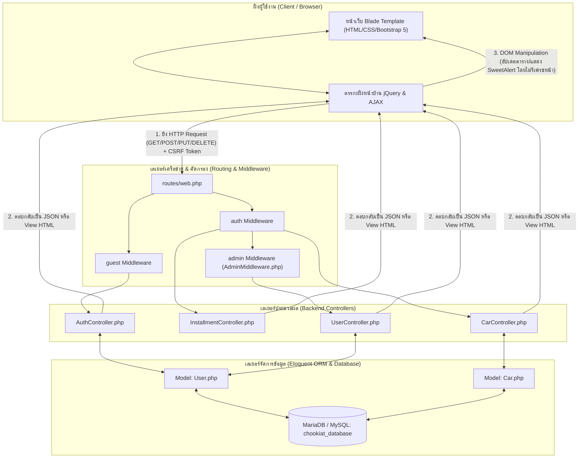
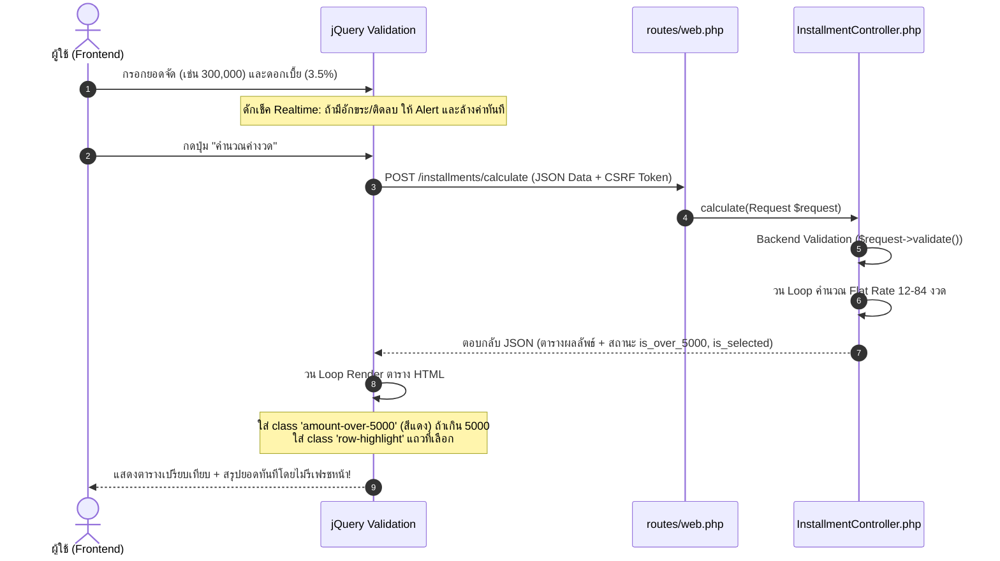
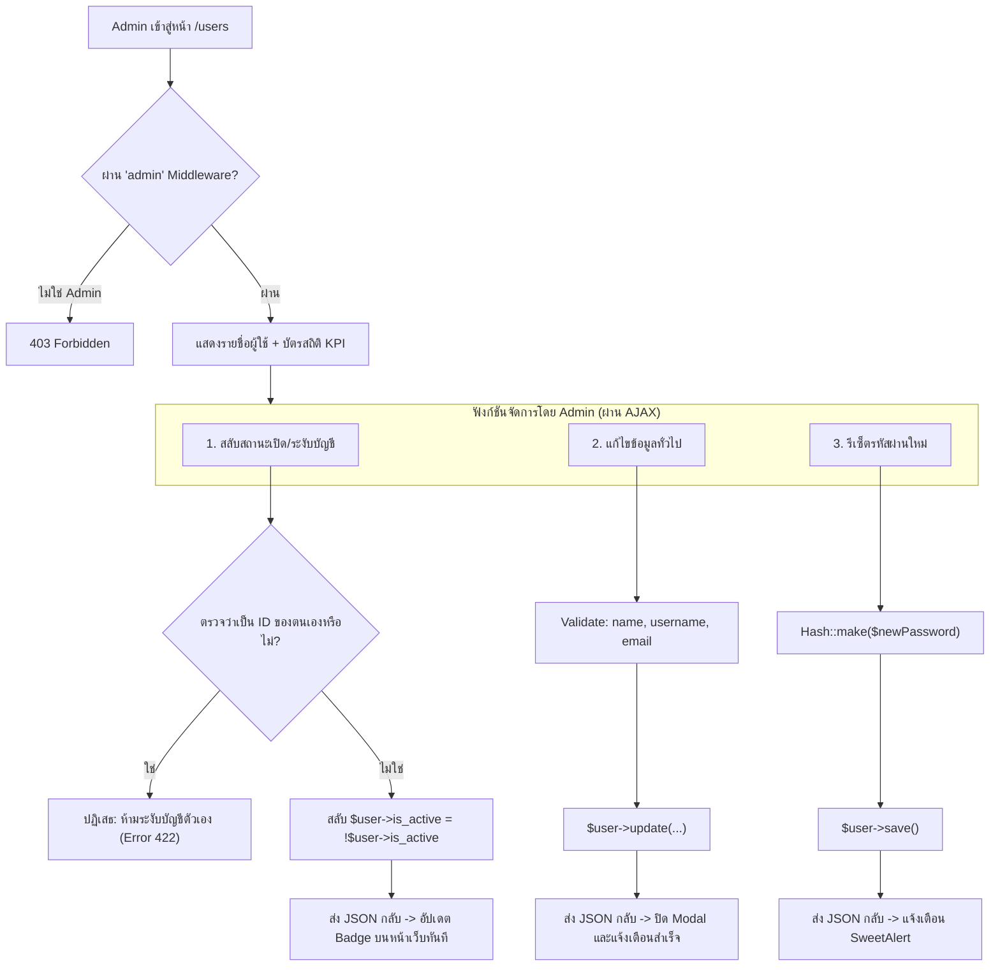
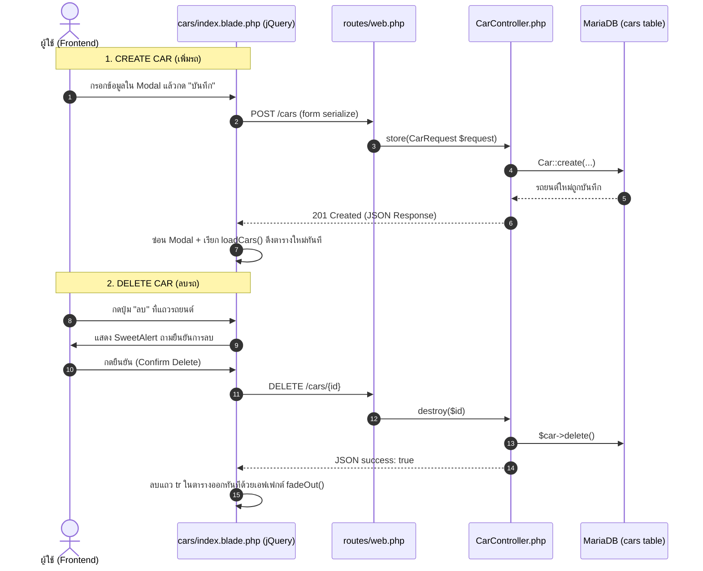

# คู่มือเจาะลึกสถาปัตยกรรมและโค้ดระบบ Chookiat System (ฉบับสมบูรณ์)
**สำหรับทำความเข้าใจ Syntax, ความเชื่อมโยงไฟล์, Frontend, API, Backend และตรรกะการคำนวณ**

---

## สารบัญ (Table of Contents)
1. [ภาพรวมสถาปัตยกรรมระบบ (System Architecture Overview)](#1-ภาพรวมสถาปัตยกรรมระบบ-system-architecture-overview)
2. [หมวดที่ 1: ระบบล็อกอิน และ สิทธิ์ผู้ใช้งาน (Authentication & Authorization)](#2-หมวดที่-1-ระบบล็อกอิน-และ-สิทธิ์ผู้ใช้งาน-authentication--authorization)
3. [หมวดที่ 2: ระบบคำนวณยอดผ่อนชำระ (Installment Calculation) + สูตรคำนวณละเอียด](#3-หมวดที่-2-ระบบคำนวณยอดผ่อนชำระ-installment-calculation--สูตรคำนวณละเอียด)
4. [หมวดที่ 3: ระบบจัดการผู้ใช้งานของแอดมิน (Admin User Management)](#4-หมวดที่-3-ระบบจัดการผู้ใช้งานของแอดมิน-admin-user-management)
5. [หมวดที่ 4: ระบบจัดการคลังรถยนต์ (Car Inventory Management — AJAX CRUD)](#5-หมวดที่-4-ระบบจัดการคลังรถยนต์-car-inventory-management--ajax-crud)
6. [สรุปตารางความเชื่อมโยงไฟล์ทั้งระบบ (System File Map)](#6-สรุปตารางความเชื่อมโยงไฟล์ทั้งระบบ-system-file-map)
7. [คลังรวม Syntax สำคัญที่ต้องเข้าใจในโปรเจกต์นี้](#7-คลังรวม-syntax-สำคัญที่ต้องเข้าใจในโปรเจกต์นี้)

---

## 1. ภาพรวมสถาปัตยกรรมระบบ (System Architecture Overview)

ระบบ Chookiat System ถูกออกแบบบนรากฐานสถาปัตยกรรม **MVC (Model-View-Controller)** ของ Laravel ผสานกับ **Client-Side Micro-Interactions** ด้วย **jQuery AJAX** ทำให้หน้าเว็บไม่จำเป็นต้องรีเฟรชทั้งหน้า (No Page Refresh) ในขณะทำธุรกรรม

### แผนภาพวงจรการทำงานรวม (System Global Architecture Flowchart)



---

## 2. หมวดที่ 1: ระบบล็อกอิน และ สิทธิ์ผู้ใช้งาน (Authentication & Authorization)

### 2.1 หน้าที่ของระบบ
- ยืนยันตัวตนผู้ใช้ด้วย **Username** และ **Password**
- ป้องกันผู้ใช้ที่สถานะบัญชีถูกระงับ (`is_active = false`) ไม่ให้เข้าสู่ระบบ
- แยกสิทธิ์การเข้าถึงระหว่าง **Admin** (ผู้ดูแลระบบ) และ **User** (ผู้ใช้ทั่วไป)
- มีระบบขอรีเซ็ตรหัสผ่านผ่านอีเมล (Forgot Password)

### 2.2 แผนภาพการทำงาน (Flowchart)

```mermaid
flowchart TD
    Start([ผู้ใช้กรอก Username & Password]) --> Submit[กดปุ่ม 'เข้าสู่ระบบ']
    Submit --> JQ_Load[jQuery: แสดง Spinner & Disable ปุ่ม]
    JQ_Load --> PostRoute[POST /login พร้อม @csrf]
    PostRoute --> ValidateReq[ตรวจสอบผ่าน LoginRequest]
    ValidateReq --> Attempt{Auth::attempt credentials}
    
    Attempt -- "ไม่ถูกต้อง" --> ErrPass[ส่ง Error กลับ: 'ชื่อผู้ใช้หรือรหัสผ่านไม่ถูกต้อง']
    ErrPass --> ShowErr[แสดง Alert สีแดงบนหน้า Login]
    
    Attempt -- "ถูกต้อง" --> CheckActive{ตรวจสอบ $user->is_active}
    CheckActive -- "is_active == false" --> LogoutForce[Auth::logout & Invalidate Session]
    LogoutForce --> ErrActive[ส่ง Error: 'บัญชีถูกระงับการใช้งาน']
    ErrActive --> ShowErr
    
    CheckActive -- "is_active == true" --> RegenSession[session()->regenerate ป้องกัน Session Fixation]
    RegenSession --> RedirectDash[Redirect ไปยังหน้า /dashboard]
```

### 2.3 ความเชื่อมโยงระหว่างไฟล์ (File Relationships)

| ลำดับ | ไฟล์ต้นทาง | ไฟล์ปลายทาง | รูปแบบการเชื่อมต่อ / เหตุการณ์ |
| :---: | :--- | :--- | :--- |
| 1 | `resources/views/auth/login.blade.php` | `routes/web.php` | Form submit หรือ AJAX ยิงมาที่ URL `/login` (ชื่อ route: `login.attempt`) |
| 2 | `routes/web.php` | `app/Http/Controllers/AuthController.php` | ส่ง Request เข้า method `login(LoginRequest $request)` |
| 3 | `app/Http/Controllers/AuthController.php` | `app/Models/User.php` | เรียก `Auth::attempt()` เพื่อไปค้นหาและเทียบ Hash รหัสผ่านในตาราง `users` |
| 4 | `routes/web.php` | `app/Http/Middleware/AdminMiddleware.php` | Route ที่ครอบด้วย `middleware('admin')` จะถูกคัดกรองสิทธิ์ก่อนเข้า Controller |
| 5 | `resources/views/layouts/app.blade.php` | `app/Models/User.php` | เมนูฝั่งหน้าบ้านเรียก `$user->isAdmin()` เพื่อซ่อน/แสดงเมนูแอดมิน |

### 2.4 เจาะลึกโค้ดและ Syntax สำคัญ

#### 1. ฝั่งหน้าบ้าน (Frontend): `resources/views/auth/login.blade.php`
```blade
<!-- 1. @csrf: จำเป็นอย่างยิ่งในการส่ง Form ใน Laravel ป้องกันการยิงคำขอปลอมแปลง -->
<form id="loginForm" method="POST" action="{{ route('login.attempt') }}">
    @csrf

    <!-- 2. @error: ดักจับและแสดง Error ที่ Controller ส่งกลับมา -->
    <input type="text" name="username" value="{{ old('username') }}" 
           class="form-control @error('username') is-invalid @enderror">
    @error('username')
        <div class="text-danger small">{{ $message }}</div>
    @enderror

    <!-- 3. jQuery: ซ่อน/แสดงรหัสผ่าน & ควบคุมสถานะปุ่มกด -->
    <script>
        $('#togglePasswordBtn').on('click', function() {
            const input = $('#password');
            const isPass = input.attr('type') === 'password';
            input.attr('type', isPass ? 'text' : 'password');
            $('#toggleIcon').toggleClass('bi-eye bi-eye-slash');
        });
    </script>
</form>
```

#### 2. ฝั่งหลังบ้าน (Backend): `app/Http/Controllers/AuthController.php`
```php
public function login(LoginRequest $request)
{
    // ดึงเฉพาะ username และ password มาตรวจสอบ
    $credentials = $request->only('username', 'password');

    // Auth::attempt: ตรวจสอบข้อมูลใน DB + เทียบ Hash รหัสผ่านให้อัตโนมัติ
    if (Auth::attempt($credentials)) {
        $user = Auth::user();

        // ตรวจสอบเงื่อนไขข้อสอบ: ถ้าบัญชีโดนระงับ (is_active = false)
        if (!$user->is_active) {
            Auth::logout();
            $request->session()->invalidate();
            $request->session()->regenerateToken();

            return back()->withErrors([
                'username' => 'บัญชีผู้ใช้นี้ถูกระงับการใช้งาน กรุณาติดต่อผู้ดูแลระบบ',
            ]);
        }

        // ป้องกัน Session Fixation Attack
        $request->session()->regenerate();
        return redirect()->intended(route('dashboard'));
    }

    return back()->withErrors(['username' => 'ชื่อผู้ใช้หรือรหัสผ่านไม่ถูกต้อง']);
}
```

#### 3. ฝั่งการตรวจสิทธิ์ (Middleware): `app/Http/Middleware/AdminMiddleware.php`
```php
public function handle(Request $request, Closure $next): Response
{
    // ตรวจว่าล็อกอินหรือยัง และมีสิทธิ์เป็น admin หรือไม่
    if (!Auth::check() || !Auth::user()->isAdmin()) {
        if ($request->expectsJson() || $request->ajax()) {
            return response()->json(['success' => false, 'message' => 'คุณไม่มีสิทธิ์เข้าถึง'], 403);
        }
        abort(403, 'คุณไม่มีสิทธิ์เข้าถึงส่วนนี้ (เฉพาะผู้ดูแลระบบเท่านั้น)');
    }

    return $next($request); // ผ่านด่าน อนุญาตให้ไปยัง Controller ได้
}
```

---

## 3. หมวดที่ 2: ระบบคำนวณยอดผ่อนชำระ (Installment Calculation) + สูตรคำนวณละเอียด

### 3.1 โจทย์และเงื่อนไข (Requirements 2.5)
1. รับค่า: **ยอดจัด (Principal)**, **อัตราดอกเบี้ยต่อปี (Interest Rate %)**, **จำนวนงวดที่เลือก (Selected Months)**
2. ตรวจสอบข้อมูล (Validation):
   - ยอดจัดต้องเป็นตัวเลขเท่านั้น ถ้าเป็นอักขระให้ Alert ทันทีและ Reset เป็นค่าว่าง
   - ถ้าติดลบให้ Alert ทันทีและ Reset เป็นค่าว่าง
3. การแสดงผล UI:
   - แสดงตารางผ่อนตั้งแต่ **12 ถึง 84 งวด**
   - ค่างวดแถวใดที่มากกว่า **5,000 บาท** ให้แสดงตัวอักษรเป็น **สีแดง**
   - เมื่อเลือกงวด ให้ **Highlight** แถวนั้นอย่างชัดเจน
   - มีปุ่ม **Clear** แสดงขึ้นมาเฉพาะเมื่อมีข้อมูลในช่อง Input อย่างน้อย 1 ช่อง

---

### 3.2 สูตรคณิตศาสตร์การคิดคำนวณ (Flat Rate Automobile Leasing Formula)

ในธุรกิจสินเชื่อเช่าซื้อรถยนต์ จะใช้ระบบดอกเบี้ยคงที่ (Flat Rate) โดยมีสูตรคำนวณดังนี้:

#### ขั้นตอนที่ 1: คำนวณจำนวนปี ($Years$)
$$Years = \frac{Months}{12}$$

#### ขั้นตอนที่ 2: คำนวณดอกเบี้ยรวมทั้งหมด ($TotalInterest$)
$$TotalInterest = Principal \times \left(\frac{InterestRate}{100}\right) \times Years$$

#### ขั้นตอนที่ 3: คำนวณยอดหนี้รวมทั้งสัญญา ($TotalAmount$)
$$TotalAmount = Principal + TotalInterest$$

#### ขั้นตอนที่ 4: คำนวณค่างวดรายเดือนก่อน VAT ($MonthlyInstallment$)
$$MonthlyInstallment = \frac{TotalAmount}{Months}$$

#### ขั้นตอนที่ 5: คำนวณภาษีมูลค่าเพิ่ม 7% ($MonthlyVAT$)
$$MonthlyVAT = MonthlyInstallment \times 0.07$$

#### ขั้นตอนที่ 6: คำนวณค่างวดรายเดือนสุทธิรวม VAT ($MonthlyWithVAT$)
$$MonthlyWithVAT = MonthlyInstallment + MonthlyVAT$$

---

### ตัวอย่างการคำนวณด้วยตัวเลขจริง (Example Walkthrough)
สมมติว่าลูกค้าต้องการจัดสินเชื่อ:
- **ยอดจัด (Principal)** = $200,000$ บาท
- **อัตราดอกเบี้ย (Interest Rate)** = $3\%$ ต่อปี
- **เลือกระยะเวลาผ่อน** = $48$ งวด

1. **จำนวนปี**: $Years = 48 / 12 = 4$ ปี
2. **ดอกเบี้ยรวม**: $TotalInterest = 200,000 \times 0.03 \times 4 = 24,000$ บาท
3. **ยอดรวมทั้งสัญญา**: $TotalAmount = 200,000 + 24,000 = 224,000$ บาท
4. **ค่างวดต่อเดือน (ไม่รวม VAT)**: $MonthlyInstallment = 224,000 / 48 = 4,666.67$ บาท
5. **VAT 7%**: $MonthlyVAT = 4,666.67 \times 0.07 = 326.67$ บาท
6. **ค่างวดสุทธิรวม VAT ต่อเดือน**: $MonthlyWithVAT = 4,666.67 + 326.67 = 4,993.34$ บาท
7. **ผลการประเมินเงื่อนไข**: $4,666.67 < 5,000$ $\rightarrow$ ตัวเลขแสดง **สีเขียวปกติ** (หากเกิน 5,000 จะเปลี่ยนเป็น **สีแดง**)

---

### 3.3 Pseudocode การทำงาน

```text
ALGORITHM CalculateInstallments(principal, interest_rate, selected_months)
    IF principal <= 0 OR interest_rate < 0 THEN
        RETURN ERROR "ข้อมูลตัวเลขไม่ถูกต้อง"
    END IF

    terms = [12, 18, 24, 30, 36, 42, 48, 54, 60, 66, 72, 78, 84]
    result_table = []

    FOR EACH months IN terms DO
        years = months / 12
        total_interest = principal * (interest_rate / 100) * years
        total_amount = principal + total_interest
        monthly_installment = total_amount / months
        monthly_vat = monthly_installment * 0.07
        monthly_with_vat = monthly_installment + monthly_vat

        is_over_5000 = (monthly_installment > 5000)
        is_selected = (months == selected_months)

        APPEND {
            months, years, monthly_installment,
            monthly_vat, monthly_with_vat, total_interest,
            total_amount, is_over_5000, is_selected
        } TO result_table
    END FOR

    RETURN result_table
END ALGORITHM
```

---

### 3.4 แผนภาพการส่งข้อมูลผ่าน AJAX (Flowchart)



---

### 3.5 เจาะลึกโค้ดและ Syntax สำคัญ

#### 1. ฝั่งหน้าบ้าน (jQuery Realtime Event): `resources/views/installments/index.blade.php`
```javascript
// ดักจับการพิมพ์ยอดจัด (Requirement 2.5: ห้ามติดลบ และห้ามมีอักขระ)
$('#principal').on('input change', function () {
    let val = $(this).val();
    if (val === '') { toggleClearButton(); return; }

    // 1. ตรวจสอบค่าติดลบ
    if (val.includes('-') || parseFloat(val) < 0) {
        alert('ยอดจัดสินเชื่อต้องไม่ติดลบ กรุณากรอกใหม่อีกครั้ง');
        $(this).val('');
        toggleClearButton();
        return;
    }

    // 2. ตรวจสอบอักขระที่ไม่ใช่ตัวเลข (RegEx: อนุญาตเฉพาะ 0-9 และจุดทศนิยมตัวเดียว)
    if (/[^\d.]/.test(val) || (val.match(/\./g) || []).length > 1) {
        alert('ยอดจัดต้องเป็นตัวเลขเท่านั้น กรุณากรอกใหม่อีกครั้ง');
        $(this).val('');
        toggleClearButton();
        return;
    }

    toggleClearButton(); // แสดง/ซ่อนปุ่ม Clear อัตโนมัติ
});

// ฟังก์ชันควบคุมการแสดงผลปุ่ม Clear
function toggleClearButton() {
    const hasValue = $('#principal').val() !== '' || 
                     $('#interest_rate').val() !== '' || 
                     $('#installments').val() !== '';
    // ปุ่ม Clear แสดงเฉพาะเมื่อ Input มีค่าอย่างน้อย 1 ค่า
    $('#btnClear').toggleClass('d-none', !hasValue);
}
```

#### 2. ฝั่งหลังบ้าน (Backend Calculator): `app/Http/Controllers/InstallmentController.php`
```php
public function calculate(Request $request)
{
    // ตรวจสอบความถูกต้องของข้อมูลฝั่งเซิร์ฟเวอร์อีกชั้น (Server-Side Validation)
    $request->validate([
        'principal' => ['required', 'numeric', 'min:1'],
        'interest_rate' => ['required', 'numeric', 'min:0'],
        'installments' => ['required', 'integer', 'min:12', 'max:84'],
    ]);

    $principal = (float) $request->principal;
    $interestRate = (float) $request->interest_rate;
    $selectedMonths = (int) $request->installments;

    $terms = [12, 18, 24, 30, 36, 42, 48, 54, 60, 66, 72, 78, 84];
    $table = [];

    foreach ($terms as $months) {
        $years = $months / 12;
        $totalInterest = $principal * ($interestRate / 100) * $years;
        $totalAmount = $principal + $totalInterest;
        $monthlyInstallment = $totalAmount / $months;

        $monthlyVat = $monthlyInstallment * 0.07;
        $monthlyWithVat = $monthlyInstallment + $monthlyVat;

        $table[] = [
            'months' => $months,
            'years' => round($years, 1),
            'monthly_installment' => round($monthlyInstallment, 2),
            'monthly_vat' => round($monthlyVat, 2),
            'monthly_with_vat' => round($monthlyWithVat, 2),
            'total_interest' => round($totalInterest, 2),
            'total_amount' => round($totalAmount, 2),
            // Requirement: เช็คว่าเกิน 5,000 หรือไม่ และตรงกับงวดที่เลือกหรือไม่
            'is_over_5000' => $monthlyInstallment > 5000,
            'is_selected' => $months === $selectedMonths,
        ];
    }

    return response()->json([
        'success' => true,
        'data' => [
            'principal' => $principal,
            'table' => $table,
        ],
    ]);
}
```

---

## 4. หมวดที่ 3: ระบบจัดการผู้ใช้งานของแอดมิน (Admin User Management)

### 4.1 หน้าที่ของระบบ (Requirement 2.4)
- **Authorize User**: กรองและตรวจสอบสิทธิ์ Admin / User
- **Reset ข้อมูล User**: แก้ไขชื่อ, username, อีเมลของผู้ใช้
- **Reset รหัสผ่าน**: ผู้ดูแลระบบสามารถกำหนดรหัสผ่านใหม่ให้ผู้ใช้ได้โดยตรง
- **ยกเลิกการใช้งาน (Toggle Active Status)**: สั่งระงับบัญชี (Deactivate) หรือเปิดการใช้งาน (Activate) โดยมีระบบป้องกันไม่ให้แอดมินเผลอระงับบัญชีของตัวเอง

### 4.2 แผนภาพการทำงาน (Flowchart)



### 4.3 ความเชื่อมโยงของไฟล์ (File Relationships)

| ลำดับ | ไฟล์หน้าบ้าน (View) | Route (`routes/web.php`) | Controller หลังบ้าน | ตาราง Database |
| :---: | :--- | :--- | :--- | :--- |
| 1 | `users/index.blade.php` | `GET /users` | `UserController@index` | `users` |
| 2 | Modal แก้ไขข้อมูล | `PUT /users/{id}` | `UserController@update` | `users` |
| 3 | Modal เปลี่ยนรหัสผ่าน | `POST /users/{id}/reset-password` | `UserController@resetPassword` | `users` |
| 4 | ปุ่มเปิด/ปิดการใช้งาน | `PATCH /users/{id}/toggle-status` | `UserController@toggleStatus` | `users` |

### 4.4 โค้ดสำคัญที่มี Business Logic ป้องกันตัวเอง: `app/Http/Controllers/UserController.php`
```php
public function toggleStatus(Request $request, $id)
{
    $user = User::findOrFail($id);

    // ความปลอดภัยสูง: ป้องกันไม่ให้ Admin กดยกเลิกการใช้งานบัญชีที่ตนเองกำลังล็อกอินอยู่
    if ((int)$user->id === (int)Auth::id()) {
        return response()->json([
            'success' => false,
            'message' => 'ไม่สามารถยกเลิกการใช้งานบัญชีที่กำลังเข้าสู่ระบบอยู่ได้',
        ], 422);
    }

    // สลับสถานะจริงใน Database
    $user->is_active = !$user->is_active;
    $user->save();

    return response()->json([
        'success' => true,
        'message' => "อัปเดตสถานะของ {$user->username} สำเร็จแล้ว",
        'is_active' => (bool)$user->is_active,
    ]);
}
```

---

## 5. หมวดที่ 4: ระบบจัดการคลังรถยนต์ (Car Inventory Management — AJAX CRUD)

### 5.1 หน้าที่ของระบบ (Requirement 2.3)
- **Create**: เพิ่มข้อมูลรถยนต์ใหม่ผ่าน Modal Form
- **Read**: แสดงตารางรถยนต์, กรองตามยี่ห้อ/สถานะ, ค้นหาแบบ Realtime, และแสดงสถิติสรุป KPI
- **Update**: แก้ไขรายละเอียดรถยนต์ผ่าน AJAX
- **Delete**: ลบข้อมูลรถยนต์พร้อม SweetAlert ยืนยัน
- **เงื่อนไขสำคัญ**: ทุก Action Method **ต้องไม่รีเฟรชหน้าเว็บ** (Full AJAX Architecture)

### 5.2 แผนภาพวงจร AJAX CRUD (Flowchart)



### 5.3 ความเชื่อมโยงระหว่างไฟล์ (File Relationships)

| ลำดับ | การกระทำ | Method | URL Route | Controller Action | Eloquent Command |
| :---: | :--- | :---: | :--- | :--- | :--- |
| 1 | ดึงข้อมูลตาราง/ค้นหา | `GET` | `/cars` | `CarController@index` | `Car::query()->where(...)->get()` |
| 2 | เพิ่มรถยนต์ใหม่ | `POST` | `/cars` | `CarController@store` | `Car::create($request->validated())` |
| 3 | ดึงข้อมูลมาแสดงใน Modal แก้ไข | `GET` | `/cars/{id}` | `CarController@show` | `Car::findOrFail($id)` |
| 4 | อัปเดตข้อมูลรถยนต์ | `PUT` | `/cars/{id}` | `CarController@update` | `$car->update(...)` |
| 5 | ลบข้อมูลรถยนต์ | `DELETE` | `/cars/{id}` | `CarController@destroy` | `$car->delete()` |

### 5.4 Syntax สำคัญในระบบจัดการคลังรถ

#### 1. การตั้งค่า CSRF Token อัตโนมัติให้ jQuery AJAX (`resources/views/layouts/app.blade.php`)
```javascript
// ผูก Token จาก <meta name="csrf-token"> เข้ากับทุก Request ของ jQuery AJAX
$.ajaxSetup({
    headers: {
        'X-CSRF-TOKEN': $('meta[name="csrf-token"]').attr('content')
    }
});
```

#### 2. ฟังก์ชันโหลดข้อมูลรถยนต์แบบไม่รีเฟรชหน้า (`resources/views/cars/index.blade.php`)
```javascript
function loadCars() {
    $.ajax({
        url: "{{ route('cars.index') }}",
        type: 'GET',
        data: {
            keyword: $('#searchKeyword').val(),
            status: $('#filterStatus').val(),
            brand: $('#filterBrand').val()
        },
        dataType: 'json',
        success: function(res) {
            if (res.success) {
                renderTable(res.data);       // วาดแถวตาราง HTML ใหม่
                updateSummary(res.summary);  // อัปเดตตัวเลข KPI บนหัวการ์ด
            }
        }
    });
}
```

---

## 6. สรุปตารางความเชื่อมโยงไฟล์ทั้งระบบ (System File Map)

```text
[Browser / User]
       │
       ▼
[resources/views/layouts/app.blade.php] (Template หลัก: Bootstrap 5, Font Prompt, CSRF Token Setup, Navbar)
       │
       ├───► [resources/views/auth/login.blade.php] 
       │            │
       │            ▼ยิง POST /login
       │     [routes/web.php] ──(guest middleware)──► [AuthController.php] ──► [User.php]
       │
       ├───► [resources/views/installments/index.blade.php]
       │            │
       │            ▼ยิง POST /installments/calculate (AJAX)
       │     [routes/web.php] ──(auth middleware)───► [InstallmentController.php] (คำนวณ Flat Rate)
       │
       ├───► [resources/views/cars/index.blade.php]
       │            │
       │            ▼ยิง GET/POST/PUT/DELETE /cars (AJAX)
       │     [routes/web.php] ──(auth middleware)───► [CarController.php] ──► [Car.php]
       │
       └───► [resources/views/users/index.blade.php]
                    │
                    ▼ยิง GET/PUT/PATCH /users (AJAX)
             [routes/web.php] ──(admin middleware)──► [UserController.php] ──► [User.php]
```

---

## 7. คลังรวม Syntax สำคัญที่ต้องเข้าใจในโปรเจกต์นี้

| Syntax / คำสั่ง | หมวดหมู่ | คำอธิบายความหมายและหน้าที่ |
| :--- | :---: | :--- |
| `@csrf` | Blade Directive | สร้าง Hidden input ที่มี Token ป้องกันการโจมตีแบบ Cross-Site Request Forgery |
| `old('field')` | Blade Helper | จำค่าเก่าที่ผู้ใช้เคยกรอกไว้ ไม่ต้องพิมพ์ใหม่เมื่อเกิดข้อผิดพลาดในการตรวจสอบ |
| `Auth::attempt($cred)` | Laravel Auth | ค้นหาข้อมูลตาม username และนำ password ไปเทียบ Hash ในฐานข้อมูลให้อัตโนมัติ |
| `Auth::user()->isAdmin()`| Model Method | เรียก Method บน Model เพื่อตรวจสอบว่าคนล็อกอินอยู่มี Role เท่ากับ `'admin'` หรือไม่ |
| `abort(403, '...')` | HTTP Response | ยุติการทำงานทันทีและส่งหน้าจอ HTTP 403 Forbidden (ไม่มีสิทธิ์เข้าถึง) |
| `$request->validate([...])` | Validation | ตรวจสอบความถูกต้องของ Input หากผิดพลาดจะส่ง Error กลับไปยัง Client ทันที |
| `number_format($val, 2)` | PHP Helper | จัดรูปแบบตัวเลขให้มีจุลภาคคั่นหลักพันและทศนิยม 2 ตำแหน่ง (เช่น `200,000.00`) |
| `$.ajaxSetup({...})` | jQuery AJAX | กำหนดค่า Header เริ่มต้นให้ทุกการยิง AJAX ของ jQuery ไม่ต้องเขียนซ้ำทุกครั้ง |
| `Car::findOrFail($id)` | Eloquent ORM | ค้นหาข้อมูลตาม ID หากไม่พบจะ Throw ข้อผิดพลาด 404 Not Found อัตโนมัติ |
| `$request->session()->regenerate()` | Security | สร้าง Session ID ใหม่เพื่อป้องกันปัญหาช่องโหว่ Session Fixation |

---
*เอกสารนี้สร้างขึ้นโดยละเอียดเพื่อรองรับการอ่านทำความเข้าใจ, ทบทวน Syntax, นำไปพรีเซนต์อธิบายระบบ หรือแปลงเป็น PDF สำหรับเก็บเป็นเอกสารอ้างอิงของโปรเจกต์ Chookiat System*
